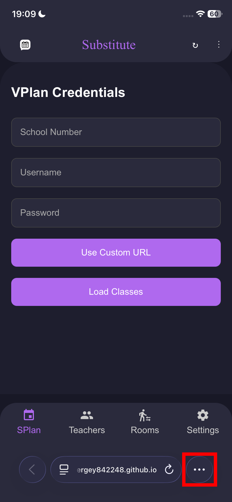
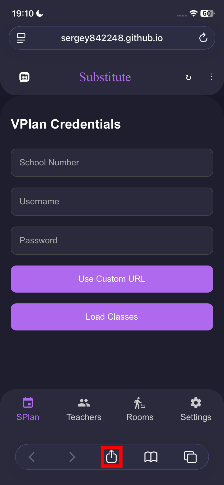
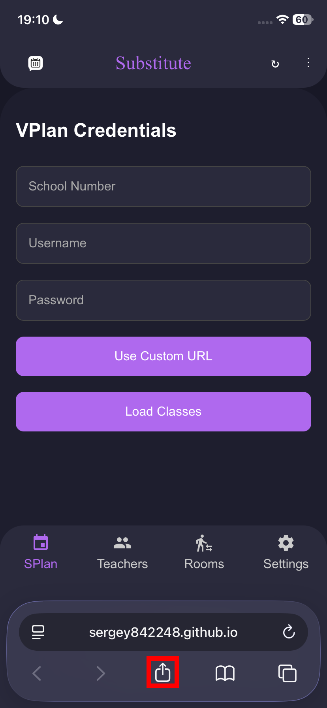
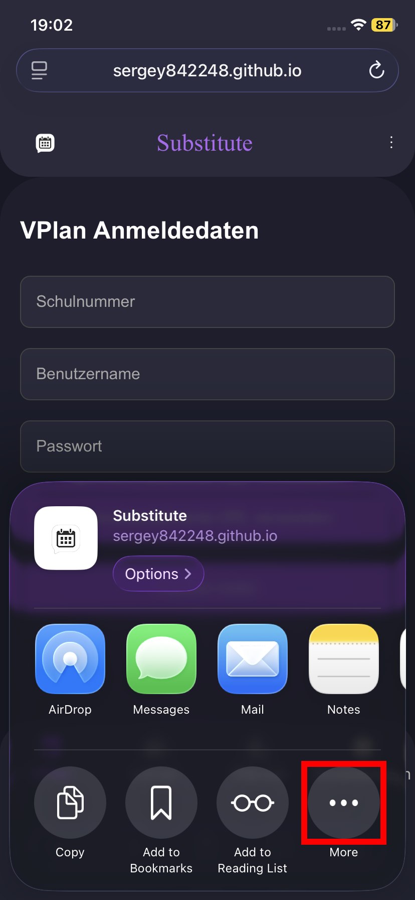
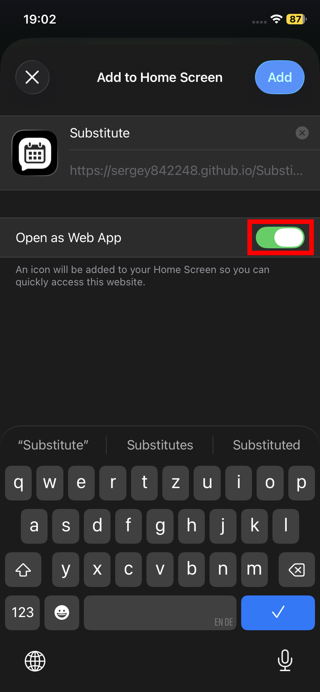

## iOS (Web App)

1. Open **Safari** and navigate to the Substitute https://sergey842248.github.io/Substitute
2.  Open the Share Menu

 

Style 1:

  <figure>
    
    <figcaption>Select the 3 dot Menu</figcaption>
  </figure>

  <figure>
    
    <figcaption>Open the Share Menu</figcaption>
  </figure>

 

Style 2:
<figure><figcaption>
Open the Share Menu
</figcaption></figure>

 

Style 3:
<figure><figcaption>
Open the Share Menu
</figcaption></figure>

3. Click on "More" in the Share Menu
<figure><figcaption></figcaption></figure>

4. Click "Add to Home Screen" in Menu
<figure><figcaption></figcaption></figure>

5. Ensure the Toggle "Web App" is enabled
<figure><figcaption></figcaption></figure>

6. Click "Add" at the top right
<figure><figcaption></figcaption></figure>

