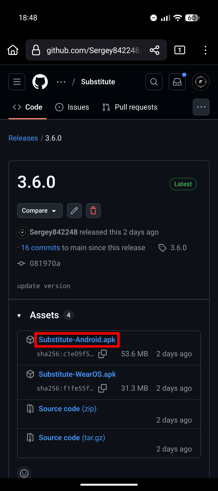
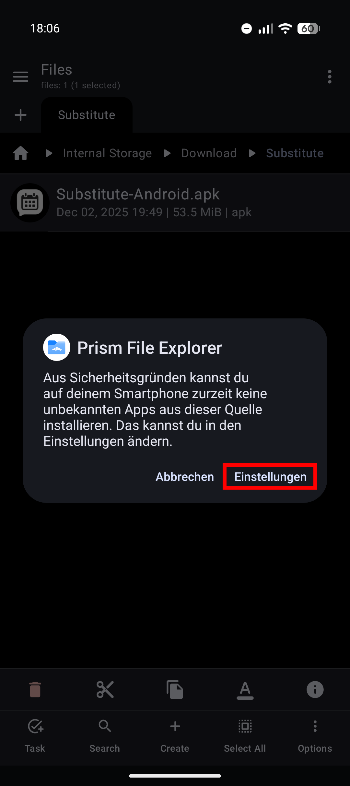
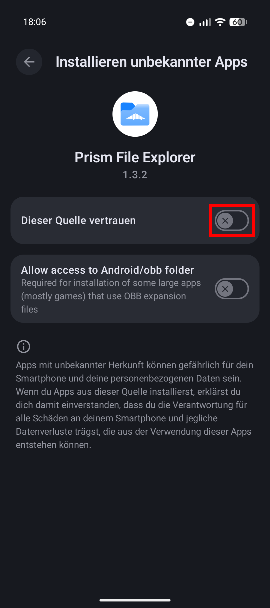
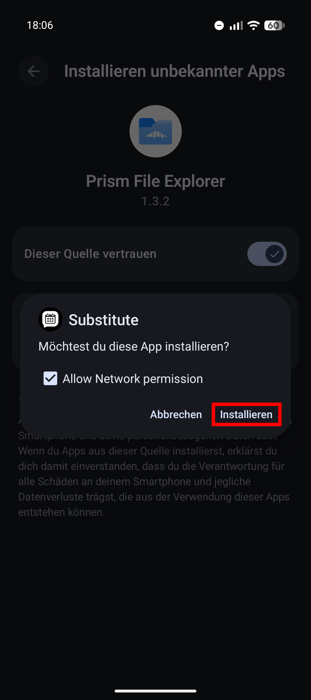

# Android



### APK herunterladen

Öffne die [GitHub Releases](https://github.com/Sergey842248/Substitute/releases) Seite und lade die Datei `Substitute-Android.apk` herunter.

<figure><figcaption></figcaption></figure>




### APK installieren

Öffne die gerade heruntergeladene APK-Datei. Möglicherweise musst du die Installation aus unbekannten Quellen in den Einstellungen deines Geräts.

<figure><figcaption>
Klicke auf "Einstellungen",  nachdem öffnen der APK-Datei
</figcaption></figure> <figure><figcaption>
Aktiviere den Schalter  "Dieser Quelle vertrauen"
</figcaption></figure> <figure><figcaption>
Klicke im neuen Dialog auf "Installieren"
</figcaption></figure>



