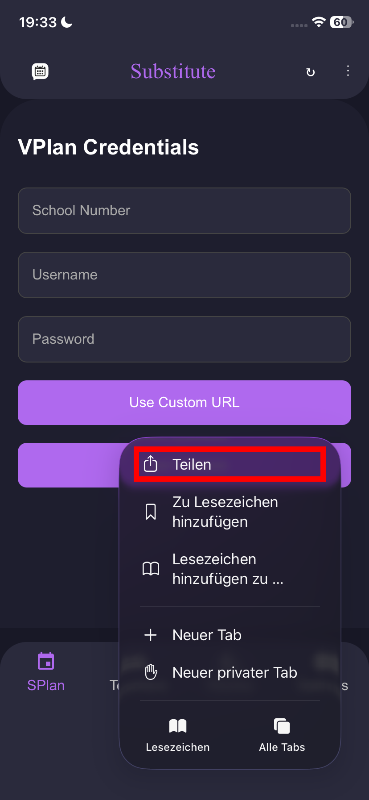
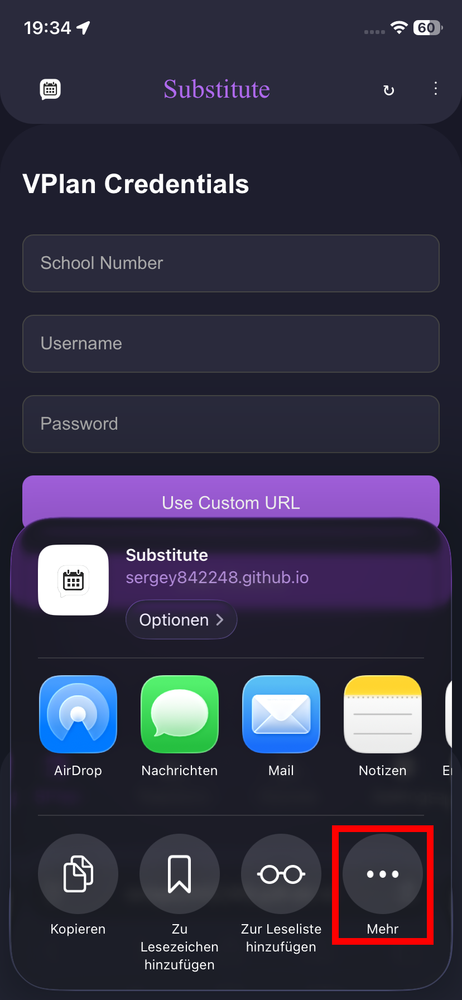
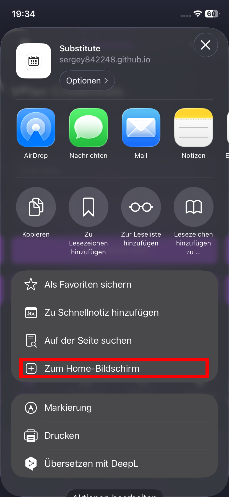
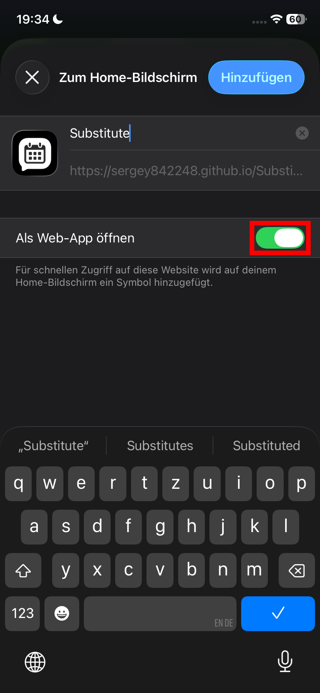
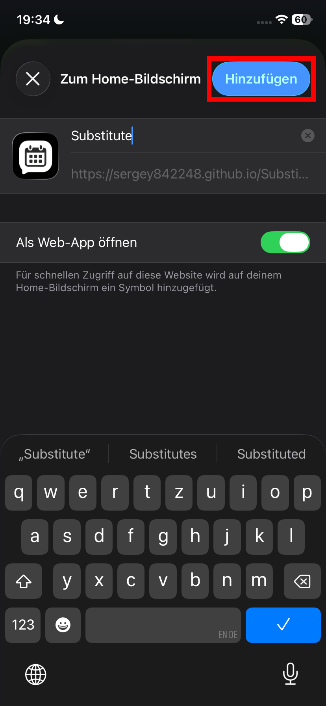

# iOS



### Öffne die Website

Öffne Safari und öffne Substitute [https://sergey842248.github.io/Substitute](https://sergey842248.github.io/Substitute)



### Öffne das "Teilen"-Menü

Stil 1:

<figure><figcaption>
Klicke auf das 3-Punkte symbol
</figcaption></figure> <figure><figcaption>
Öffne das "Teilen"-Menü
</figcaption></figure>

Stil 2:

<figure><figcaption>
Öffne das "Teilen"-Menü
</figcaption></figure>

Stil 3:

<figure><figcaption>
Öffne das "Teilen"-Menü
</figcaption></figure>




### Klicke im "Teilen"-Menü auf "Mehr"

<figure><figcaption></figcaption></figure>




### Klicke im Menü auf "Zum Home-Bildschrim"

<figure><figcaption></figcaption></figure>




### Stelle sicher, dass der Schalter "Als Web App öffnen" aktiviert ist

<figure><figcaption></figcaption></figure>




### Klicke oben rechts auf "Hinzufügen"

<figure><figcaption></figcaption></figure>



